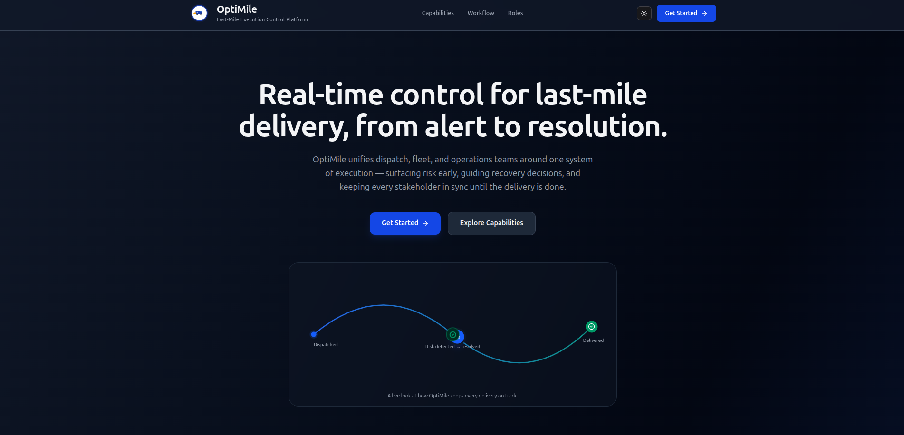
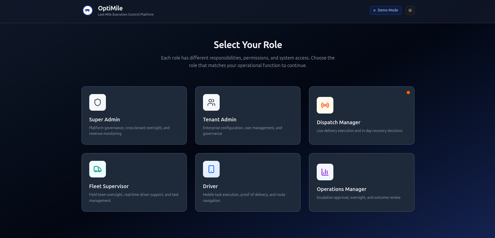
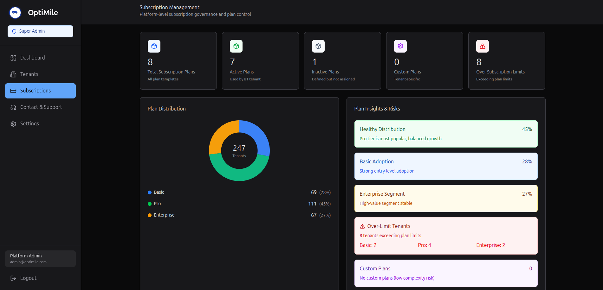

# OptiMile

OptiMile is a last-mile delivery execution control platform. It brings dispatch, fleet, and operations teams onto one system so that risk gets surfaced the moment it emerges, recovery decisions are made with full context, and every stakeholder — from a platform admin to a driver on the road — stays in sync until a delivery is done.

This repo is a fully interactive, role-based prototype: pick a role, sign in, and explore that role's real workflow end to end.

## What it does

A delivery day rarely goes exactly to plan — routes slip, customers are unavailable, vehicles get overloaded. OptiMile is built around the loop every operations team runs to handle that:

- **Detect** — live risk signals and alerts, ranked by operational impact, so nothing critical gets buried.
- **Decide** — compare recovery options side by side with projected impact before committing to a plan.
- **Resolve** — commit the plan, monitor execution in real time, and close the loop with a full, audit-ready decision trail.

## The flow

1. **Homepage** — a marketing-style landing page introducing the platform's capabilities and the Detect → Decide → Resolve workflow.
2. **Role Selection** — choose the role you want to explore: Super Admin, Tenant Admin, Dispatch Manager, Fleet Supervisor, Driver, or Operations Manager. Each role has a different scope of responsibility and a different set of screens.
3. **Login** — a lightweight demo sign-in for the selected role.
4. **Role dashboard** — you land in that role's home base and can navigate its full workflow, for example:
   - **Super Admin** — cross-tenant oversight, subscription/plan governance, and platform-wide support.
   - **Tenant Admin** — enterprise workspace setup, users, roles, and company settings.
   - **Dispatch Manager** — live routes, driver capacity, alerts, and in-day recovery/escalation flows.
   - **Fleet Supervisor** — driver and vehicle management, capacity signals, and fleet exceptions.
   - **Operations Manager** — escalation approvals, SLA risk oversight, and outcome review.
   - **Driver** — a mobile-first view for today's stops, navigation, and proof of delivery.

The whole experience is responsive end to end, from phone widths up through desktop, and supports both light and dark themes.

## Screenshots

**Homepage**

**Role Selection**

**Subscription Management (Super Admin)**

